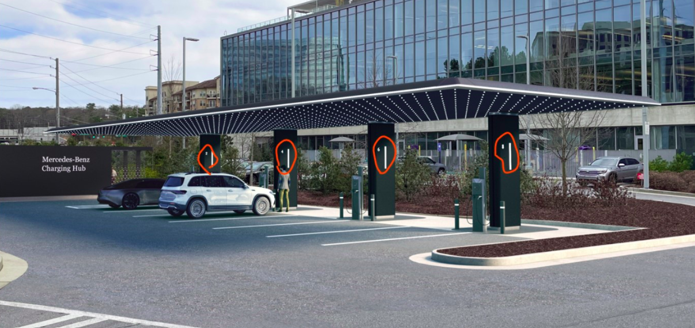
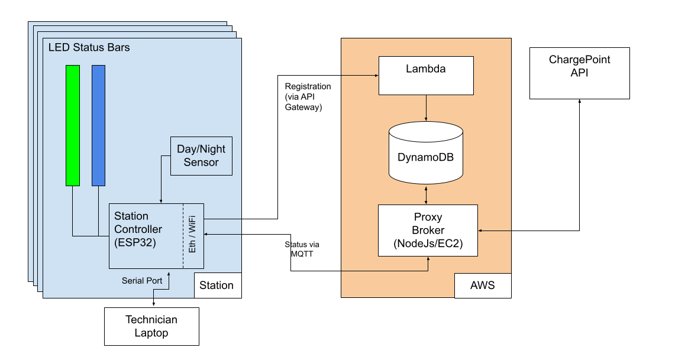
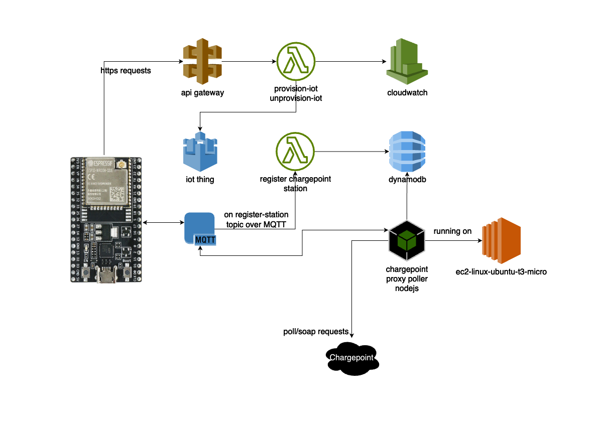
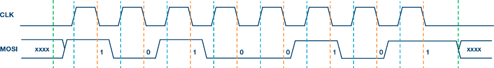

| <span style="color: #A00;">THIS DOCUMENT IS THE CONFIDENTIAL PROPERTY OF MN8 Energy. NO RIGHTS ARE GRANTED TO USE THIS DOCUMENT FOR ANY PURPOSE OTHER THAN FURNISHING SERVICES AND SUPPLIES TO MN8 Energy.</span> |
| :----------------------------------------------------------: |

# Software Design Document: State of Charge LED Display System

This document describes and provides supporting details for the software design of the SOC (State of Charge) LED indicator system. 


## Version History

| Version | Date        | Author     | Notes   |
| ------- | ----------- | ---------- | ------- |
| v0.1    | Oct-04-2023 | McGuinness | Initial |
|         |             |            |         |


## Table of Contents

[TOC]

## Scope

This document describes the software components for MN8 Energy's State of Charge (SOC) LED indicator for an EV Charging Station.  

This document applies to the entire product, including an embedded controller and several cloud-based software packages. 

### Background

#### Project Origination

MN8 identified a need for visual reporting of an EV charging station port. Charing port status can be read by an EV, device app, or from the port display, but a fixed "always-on" indicator visible from a distance will improve user experience. 

A conceptual rendering of the LED Indicators at a charging station was provided by MN8 at project start. This photo is for reference only, and does not define any project requirements. For example, the smaller secondary indicator to the left of the larger LED strip is not part of this project.



**Figure 1: Conceptual Rendering of LEDs at four charging stations**


#### Design History/Notes

This section identifies design changes that drove software solutions.

* A single embedded Station Controller housed in each Charging Station "pillar"  controlling up to 2 LED Strips
* Requirement are that LEDs use only the ChargePoint API:
  * ChargePoint API uses SOAP, requiring complex request assembly and response parsing
  * Requirements for LED status change required frequent polling of the ChargePoint API
    * Potential for higher costs at remote sites
    * Potential to overwhelm ChargePoint API

* Design evolved to include a Proxy Broker:
  * Single point of contact with ChargePoint API
  * Knows about entire fleet of installed devices
  * Uses MQTT to report status to Station Controllers


## Reference Documents

All documents below are available in [Basecamp](https://3.basecamp.com/3162450/projects/33639386): 

* *"ChargePoint Web Services API Programmer’s Guide, v5.1*", ChargePoint
* Espressif *"led_strip_example"* project delivered with ESP IDF v5.2, Espressif  
* *"WS2815 Intelligent control LED integrated light source"*, World Semi
* *"SOC LED Light Requirements and Standards"*, MN8 Energy

## Operating Environment

This section will describe the software running on each component of the system.

### Station Controller

The Station Controller is an on-site ESP32 micro controller on an AppliedLogix designed PCB in a custom enclosure.  Each Station Controller supports one or two LED bars, one for each charging port. The charging ports are typically on the left and right side of a central pillar.

The Station Controller is connected to the Internet via Ethernet and WiFi. The Station Controller is powered by PoE;  a WiFi connection is used as a backup for Ethernet. 

The Station Controller allows installers to register the station. During normal operation, the Station Controller will  interpret MQTT messages from the Proxy Broker and control the LED status bar(s). 

### Proxy Broker

The Proxy Broker centralizes requests to the ChargePoint API and delivers status updates to Station Controllers via MQTT. This is Javascript code running under Ubuntu on an AWS EC2 instance.

#### AWS Lambda

AWS Lambda provides a server-less mechanism for executing code on demand. It is used in this design to handle registration requests from Station Controllers. 

#### AWS DynamoDB

Provides key-value storage for all known Station Controller IDs within AWS. 

## Structural Design

This section describes software components and interfaces, and the lineage of design decisions leading to the resulting structure.



**Figure 2:  System Block Diagram**


A more detailed breakdown of components within the AWS block above is shown here: 



**Figure 3:  AWS Detailed Block Diagram**


### Station Controller Software

Initial prototype testing started from the ESP SDK "led_strip_example" project, and expanded to include: 

- External serial port (115200/N/8/1) providing Command Line Interface (CLI) for config/debug
- Ability to register Station with AWS via serial port CLI
- MQTT Client to interpret station state from Proxy Broker
- Changed LED driver to SPI-based interface to work around known ESP example bug 
- Day/Night sensor connected via GPIO to drive LED brightness settings
- Source code is https://gitlab.appliedlogix.com/mn8-energy/light-controller-firmware

### AWS Infrastructure

This section describes the components implemented in Amazon Web Services (AWS). Currently everything is running under an Applied Logix account (Acct ID: 704412387318). 

#### Proxy Broker

This is a t2.micro (low-cost, single CPU, 1GB memory) EC2 instance running the following: 

- Ubuntu 20.04
- "asdf" runtime version manager 
- "node" version 18.18.0 
- "npm" version 9.8.1
- SSH server, port 22 opened to specific IP ranges as needed (via Security/Inbound Rules)
- Source code from here: https://gitlab.appliedlogix.com/mn8-energy/chargepoint-poll-proxy
- File ".env" Specifying the following: 

```
	`AWS_ARN=arn:aws:iot:us-east-1:704412387318:thing/502B838D3A08` 
	`AWS_CLIENTID=al-site-proxy` 
	`AWS_HOST=a12nujv5ze1vit-ats.iot.us-east-1.amazonaws.com` 
	`AWS_PORT=8883` 
	`AWS_KEY=./.secrets/private.pem.key` 
	`AWS_CERT=./.secrets/certificate.pem.crt` 
	`AWS_CA=./.secrets/AmazonRootCA1.pem`
	`CP_ENDPOINT=https://webservices.chargepoint.com/webservices/chargepoint/service`
	`CP_USERNAME=<hidden>`
	`CP_PASSWORD=<hidden>`
```

* Directory ".secrets" with the following files allowing for access to AWS 

  ```
  `AmazonRootCA1.pem`  
  `certificate.pem.crt`  
  `private.pem.key`  
  `public.pem.key`
  ```

  

#### AWS Lambda 

AWS Lambda functions allow for single-shot event handling without need for a dedicated server. We use this for device registration. 

- Code is here: https://gitlab.appliedlogix.com/mn8-energy/cloud-lambdas

## Detailed Design

### Station Controller Software

#### General

* This is an embedded C++ application using the ESP32 IDF development tools

* FreeRTOS is commonly incorporated into ESP32 designs, and is used here as an operating system. FreeRTOS Threads: 

  * LED Threads (2)
    * Thread affinity used to keep these two threads on a single controller
  * CLI Thread 
  * MQTT Monitor Thread
    * Listen for station state updates via MQTT 
  * Day/Night Sensor Monitor 
  * Network Status Monitor

* Network Connectivity

  The default operational mode will be using wired Ethernet. The WiFi interface is used as a backup in the event of connection or other failure detected on the Ethernet interface. 

#### Command Line Interface

A command-line interface is available via Serial port.  Debug messages will be logged to this port, and it will accept user commands.

​	Input is done at this command prompt: 

```
		mn8-tools>
```

<u>The following commands allow technicians to configure the Station Controller:</u>


**provision_cp**   *\<group or site name\> \<station id\>*   Provision Station Controller

​	*\<group or site name\>*  Site or group name where this station is located   

​	<station id\>*  Charge point station id  

**provision_iot**    *\<url> \<username> <password\>*   Provision Station Controller as an IOT device          

​	*\<url>*  Url to provisioning server    

​	*\<username>*  API username     

​	*\<password>*  API password


<u>The following commands provide troubleshooting and debugging for the Station Controller:</u> 

**help**    Print the list of available commands  

**tasks**    Get information about running tasks/threads  

**wifi**  [--timeout=*\<t>*] *<join/leave>* [*\<ssid>*] [*\<pass>*]     

​	*\<t>*  Connection timeout, ms   		

​	*<join/leave>*  Command to execute         

​	*\<ssid>*  SSID of AP         

​	*\<pass>*  PSK of AP  

**ifconfig  **[*<eth/wifi>*] [*<up/down/dhcp/manual/reset>*] *[\<ip>*] [*\<netmask>*] [*\<gateway>*] [*\<dns>*]   Configure/view network interfaces (wifi/ethernet)     

​	*<eth/wifi>*  Which interface to configure   			

​	*<up/down/dhcp/manual/reset>*  Command to execute           

​	*\<ip>*  IP address

​	*\<netmask>*  Netmask     

​	*\<gateway>*  Gateway

​	*\<dns>*  DNS  

**reboot**    Reboot board  

**ping**  [-W  *\<t>*]  [-i  *\<t>*]  [-s *\<n>*]  [-c *\<n>*]  [-Q *\<n>*]  \<host>   send ICMP ECHO_REQUEST to network host   		

​	*-W, --timeout=\<t>*  Time to wait for a response, in seconds   

​	*-i, --interval=\<t>*  Wait interval seconds between sending each packet   

​	*-s, --size=\<n>*  Specify the number of data bytes to be sent   

​	*-c, --count=\<n>*  Stop after sending count packets   

​	*-Q, --tos=\<n>*  Set Type of Service related bits in IP datagrams         

​	*\<host>*  Host address  

**led**  *<on/off/pattern>*  [-p *\<p>*]  [-s *< 1 | 2 >*]   Control LED strips   

​	*<on/off/pattern>*  Command to execute   

​	*-p, --pattern=\<p>*  Index to the desired pattern, 0 by default   

​	*-s, --strip=<1/2>*  Which strip to control. If no value is given, both strips will be controlled 

#### LED Driver

The LED strips use the WS8215 protocol. Each LED strip has multiple controllers wired in series along the length of the strip. Depending on the LED strip model, each LED controller may control multiple LEDs (in our case, three LEDs per controller). The LED controllers are not aware of their physical position in the strip; this allows for easy cutting, resizing, and joining of strips.

Each LED controller has a DIN pin for input signaling and a DO for cascading the signal to the next downstream LED controller. Each LED controller interprets the first 24 bits of data it sees at DIN as a command and set its color accordingly. The LED controller forwards subsequent signals to the DO pin, which is wired to the next LED controller's DIN. The next LED controller will repeat the process. 

The bit sequence will be truncated and propagated along the LED strip until signal is exhausted or no more LEDs are present. Each LED controller maintains current color and forwards signals until a RESET is seen. 

Our LED strip uses 31 controllers to drive 93 LEDs.  Each 24-bit sequence is interpreted as GRB (Green, Red, Blue) as follows:


| G7   | G6   | G5   | G4   | G3   | G2   | G1   | G0   | R7   | R6   | R5   | R4   | R3   | R2   | R1   | R0   | B7   | B6   | B5   | B4   | B3   | B2   | B1   | B0   |
| ---- | ---- | ---- | ---- | ---- | ---- | ---- | ---- | ---- | ---- | ---- | ---- | ---- | ---- | ---- | ---- | ---- | ---- | ---- | ---- | ---- | ---- | ---- | ---- |

**Figure 4:  GRB Bit Sequencing**

Because there is only a single data line to the LED strip (no clock signal), the line must be driven high/low for reach GRB bit transmitted. The duration of the high signal during each cycle indicates whether the bit should be interpreted as 0 or 1. 

The LED controller expects the following duty cycles, per the WS8215 specification: 

|       | Code                    | Duration     |
| ----- | ----------------------- | ------------ |
| T0H   | 0-code, High-level time | 220ns-380ns  |
| T1H   | 1-code, High-level time | 580ns-1600ns |
| T0L   | 0-code, Low-level time  | 580ns-1600ns |
| T1L   | 1-code, Low-level time  | 220ns-420ns  |
| RESET | Drive line low          | > 280000ns   |

**Figure 5:  LED Controller Timing Requirements (WS8215)**


Cycles must be between 900ns (220ns+580ns) and ~2000ns (380/420ns + 1600ns). We found example ESP32 projects that used a pulse width of 1200ns, which falls on the faster side of the range but comfortably above the minimums. 

Our design makes use of ESP SDK's SPI library to drive the LED signal line. SPI is often used for peripheral communications; in normal use the SPI uses several signals including clock and data out (MOSI). For our LED implementation, we will use only the MOSI line. 

Typical SPI signaling to send an 8-bit sequence (10100101) looks like this (CLK and MOSI lines only):




​							

**Figure 6:  SPI Timing (CLK/MOSI)**


With an SPI clock speed of 6.66MHz , each SPI CLK cycle is 150ns.  We can hold the MOSI line high or low for multiples of 150ns by "sending" one of two bit sequences to the SPI driver (from file RmtOverSpi.cpp): 

```
static const uint8_t mZero = 0b11000000; // 300:900 ns 
static const uint8_t mOne  = 0b11111100; // 900:300 ns 
```

Note that transmission of a single bit to the LED strip requires eight SPI CLK cycles. With the sequences above, the MOSI line will be high for 300ns or 900ns, then low for 900ns or 300ns. This provides the desired LED pulse width of 1200ns and high/low durations well within the specification. 

The time required to address all LEDs is minimal and not visible. With 33 LED controllers using 24 bits each, and 1.2us required for each LED bit, we can update the entire LED strip in less than 0.1 milliseconds. 

#### LED Animation Colors/Patterns

Several colors and patterns are used to indicate station state.

| Station State     | LED Color      | Pattern  |
| ----------------- | -------------- | -------- |
| Station Available | Green          | Solid    |
| Waiting for Power | Cyan           | Solid    |
| Charging Complete | Blue           | Solid    |
| Charging          | Blue/White     | Charging |
| Offline           | White          | Solid    |
| Reserved          | Orange         | Solid    |
| Unknown           | Purple/Magenta | Solid    |
| Out of Service    | Red            | Solid    |
| Booting Up        | Yellow         | Pulsing  |

**Figure 7: Station State Color Indicators**


##### Charging Animation

The Charging animation is a blue on white pattern, with an animated "chase" of blue LEDs appearing to "move up" the LED bar from a base level towards the current charge level.

The charging animation was designed to be flexible and changeable if a different pattern is desired. The pattern consists of multiple components (each represented as  C++ objects). Depending on the number of LEDs used and the current charge levels, some objects may not be shown due to overlap.

- B (Base):  Fixed LED indicator at bottom of LED bar. Always on
- CI (Charge Indicator):  Composite object consisting of PA and CL
- PA (Progress Animation):  "Chase" effect implemented with a PA and CL object. LEDs appear to move up the LED bar from B to CL.  Implemented with two static segments, H and L
- CL (Charge Level): Fixed-length (currently 2) indicating current charge level
- H (High):  Part of PA, the yet-to-be-illuminated LEDs in a "chase" pattern
- L (Low):  Part of PA, the already-illuminated LEDs in a "chase" pattern
- T (Top):  Extends beyond CL to the top of the LED bar

```
            0                   1                   2                   3
            0 1 2 3 4 5 6 7 8 9 0 1 2 3 4 5 6 7 8 9 0 1 2 3 4 5 6 7 8 9 0 1
           |B|B|B|B|B|B|.|.|.|.|.|.|.|.|.|.|B|B|.|.|.|.|.|.|.|.|.|.|.|.|.|.|
           |B|B|B|B|B|B|B|.|.|.|.|.|.|.|.|.|B|B|.|.|.|.|.|.|.|.|.|.|.|.|.|.|
           |B|B|B|B|B|B|B|B|.|.|.|.|.|.|.|.|B|B|.|.|.|.|.|.|.|.|.|.|.|.|.|.|
           |B|B|B|B|B|B|B|B|B|.|.|.|.|.|.|.|B|B|.|.|.|.|.|.|.|.|.|.|.|.|.|.|
            │ ├─── L: Low ──┘ └─ H: High ───┤ │ │                         │
            │ ├─── PA: Progress Animation ──┤ │ └──────── T: Top ─────────┤
            │ └──  CI: Charge Indicator  ───┴┬┘                           │
            ├─ B (Charge 'base')             └── CL: Charge Level         │
            └─────────────────── CA: (Charge Animation) ──────────────────┘

```

**Figure 8: Example of Charging Animation (32 LEDs, Charge level ~55%)**

One requirement based on feedback from MN8 is for the CL indicator to remain in place until the PA has reached the CL.  This is subtle, but visually more pleasing as the charge increases.

##### Pulsing Animation

Pulsing Animations encompass the entire LED strip and are less complex than the Charging Animation. Each LED can be set to a level between 0 and 255. The non-linear response of the LED is handled by one or more "Pulse Curves" that control the rate of attack/decay of the pulse animation. Currently a "smooth" curve is implemented, and this can be expanded or changed.

##### Colors

Colors are designed to be as bright as possible while being visually distinct from each other. RGB are straightforward; composite colors were modified slightly during development based on visual observation of the LED bar in both indoor and outdoor settings.

|                | R    | G    | B    |
| -------------- | ---- | ---- | ---- |
| Red            | 0xFF | 0x00 | 0x00 |
| Green          | 0x00 | 0xFF | 0x00 |
| Blue           | 0x00 | 0x00 | 0xFF |
| White          | 0x80 | 0x80 | 0x80 |
| Orange         | 0xFF | 0x70 | 0x00 |
| Cyan           | 0x00 | 0xFF | 0x80 |
| Yellow         | 0xFF | 0xFF | 0x00 |
| Purple/Magenta | 0xFF | 0x6D | 0xC5 |
|                |      |      |      |

**Figure 9: Daytime colors in RGB format**

#### Day/Night Mode

In full daylight, we run the LED bar at or close to its maximum brightness. The system includes a binary day/night sensor to lower the LED intensity during nighttime.  A second set of colors is available via a "Colors" object that knows the day/night status. Color values for "night" mode are currently approximately half of the values shown in Figure 9; final values are TBD after some field testing.

#### Unit Testing

Unit tests using the publicly available Google Test (gtest) framework. The tests reside in directory "main/gtest".

- Tests low level color conversion functions
- Test animation patterns against various charge levels and varying number of LEDs
- Includes interactive mode (-i option) that allows users to visualize the LED bar using animations with different parameters

### Proxy Broker Software

The Proxy Broker acts as an intermediary between the ChargePoint API and the set of Station Controllers being used. This application is written in Javascript and run via *npm* on an AWS EC2 instance.

#### Proxy Broker: Connecting to Instance

Connecting to this instance will require:

* AppliedLogix Account ID and IAM user name
* SSH client application
* SSH private Key
* If accessing outside of Winton Place, an inbound rule on AWS allowing your public IP to connect to port 22 of the Proxy Broker instance (this is for SSH access only; normal operation does not require changes to AWS rules for MQTT or API traffic).

#### Proxy Broker: Code Organization

The EC2 instance has a dedicated directory for the Proxy Broker:

```
	/home/ubuntu/proxy-broker/chargepoint-poll-proxy
```

During development, this directory is pointed at the AppliedLogix gitlab Proxy Broker repo (see link earlier in this document). This allows developers to pull and deploy changes quickly.

#### Proxy Broker: Run/Debug Modes

Running in "Normal Mode", the Proxy Broker will query DynamoDB for list of known stations, then enter a loop requesting status from ChargePoint and sending updates to Station Controllers via MQTT. 

```
		% npm start poll 
```

Running in "Debug Mode". In this mode, several debug commands may be used to emulate ChargePoint device changes. 

```
		% npm start cli 
```

In this mode, the Proxy Broker will not automatically poll ChargePoint API (unless commanded to). This mode allows developers to emulate various state changes as if they are coming from ChargePoint.  This mode shows a user prompt: 

```
	? prompt>
```

The following commands are supported: 

**poll**	Make a single query to ChargePoint and update Station Controller(s)

**state** 	*\<LED ID> \<state string>* 

Sets the internal state of an LED ID to a state string. Valid states (and numeric values). LED bars are numbered 1 and 2 within the Proxy Broker.  		See table below: 

**m** 	*\<LED ID> \<Numeric State Value>* 

Sets the internal state of an LED ID to a numeric value. Identical to **state** but easier to type.  See table below:

```
   STATE STRING             NUMERIC VALUE
  
   * available				(0)
   * waiting_for_power 		(1)
   * charging				(2)    // May supply charging value [0-100]
   * charging_complete		(3)
   * out_of_service			(4)
   * disable				(5)
   * booting_up				(6)
   * offline				(7)
   * reserved				(8)
   * test_charging			(9)
   * unknown					
```

Examples: 

```
? prompt> state 1 available        // Sets LED 1 to green
? prompt> m 2 2 50                 // Sets LED2 to "charging" with level of 50% 
```


## Glossary

​	

| Term   | Meaning                                                      |
| ------ | ------------------------------------------------------------ |
| API    | Application Programming Interface                            |
| AWS    | Amazon Web Services                                          |
| CLI    | Command Line Interface                                       |
| CP     | ChargePoint                                                  |
| DIN    | Data In (LED Controller)                                     |
| DO     | Data Out (LED Controller)                                    |
| DNS    | Domain Name Service. Resolves domain (e.g. "www.appliedlogix.com") to IP address. |
| EC/EC2 | Elastic Compute                                              |
| ESP    | Espressif Systems, a microcontroller manufacturer and SDK provider |
| EV     | Electric Vehicle                                             |
| GPIO   | General Purpose Input/Output                                 |
| LED    | Light Emitting Diode (Strip of LEDs in this case)            |
| MOSI   | SPI line driving output                                      |
| MQTT   | Lightweight publish/subscribe network protocol; used to manage IOT devices |
| PoE    | Power over Ethernet                                          |
| RGB    | Red/Green/Blue color model                                   |
| SOAP   | Simple Object Access Protocol                                |
| SOC    | State of Charge                                              |
| SPI    | Serial Peripheral Interface                                  |
| SSH    | Secure Shell                                                 |

